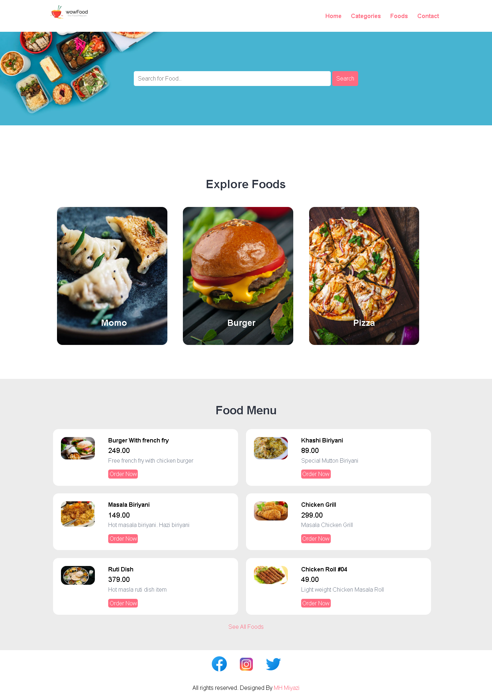
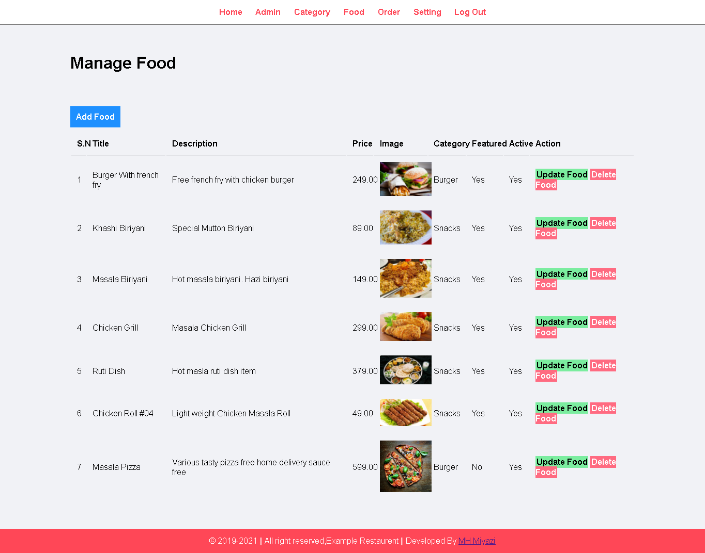
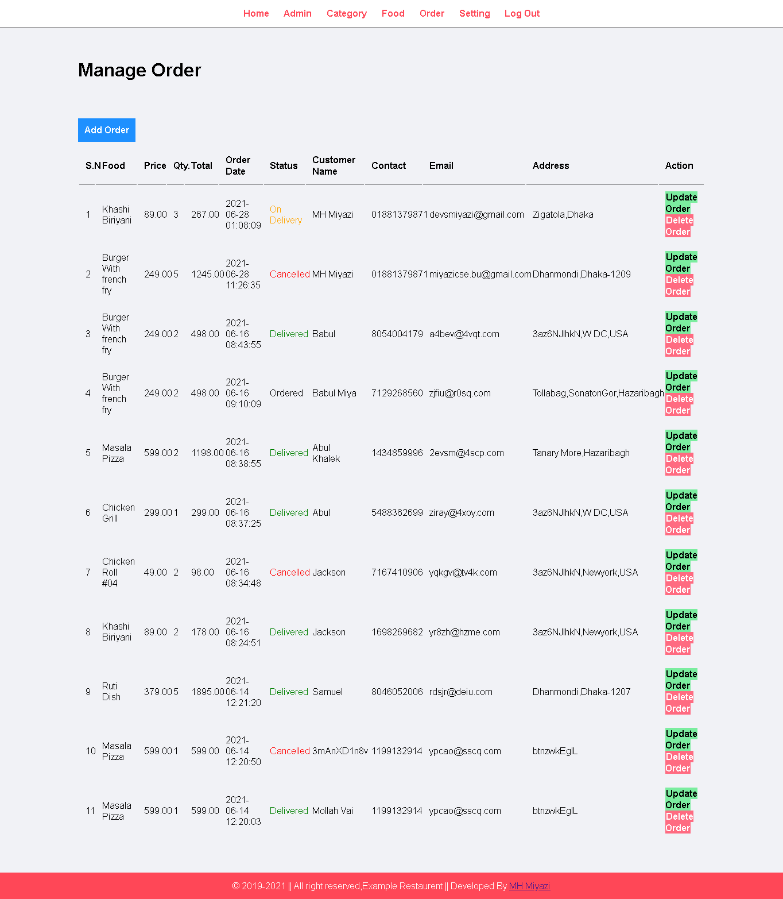

 
<h1>Food-Order-CMS</h1>

<b>Technology used: </b>

<blockquote>
  

 1.PHP  
 2.HTML  
 3.CSS  
 4.Javascript(little bit)
  

</blockquote>
 
 <strong>Main Feature</strong>
 <blockquote>
  

  <code>Customer :</code> 
 1.User Interface  
 2.Placing Order 
 3.User Tracking Order  
 4.User Billing Method (Cash On delivery)  
 
  
  <code>Owner :</code> 
 1.Awesome CMS  
 2.Tracking Order  
 3.Manage Order(Add,View,Edit,Delete)  
 4.Manage Food (Add,View,Edit,Delete) 
 5.Manage Category (Add,View,Edit,Delete) 
 6.Manage Admin (Add,View,Edit,Delete) 
 7.Manage Currency (Add,View,Edit,Delete) 
 8.Setting System 

  

</blockquote>

<strong>**Special Feature**</strong> 
<blockquote>
  1.SQL Injection Prevention  
  2.UnAuthorised Access Prevent  
  3.User Session Tracking  
</blockquote>
<blockquote>
  
 Customer: https://restaurant.mhmiyazi.com/restaurant1/   
 Admin: https://restaurant.mhmiyazi.com/restaurant1/admin   
 User: admin  
 Password: admin     
 </blockquote>
# More feature will be coming soon.......

<h2>Take a look:</h2>

